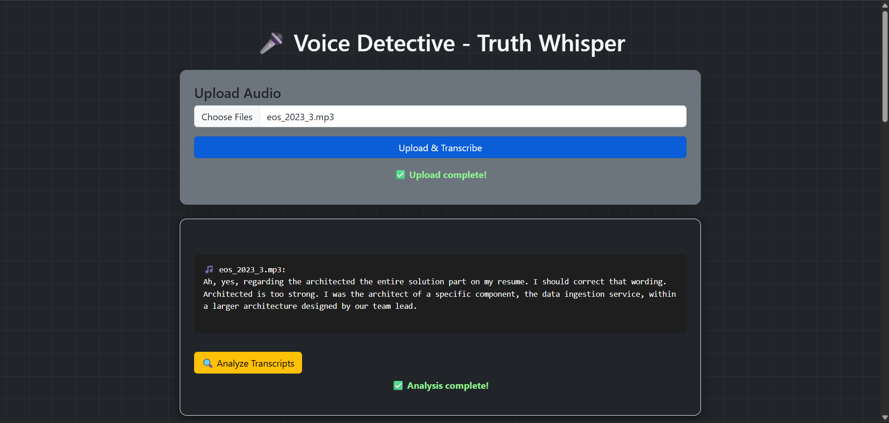
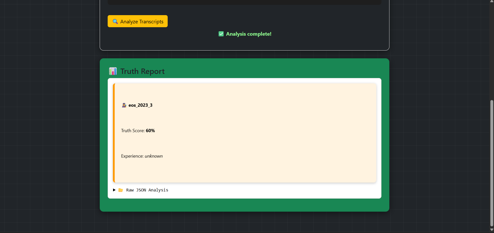
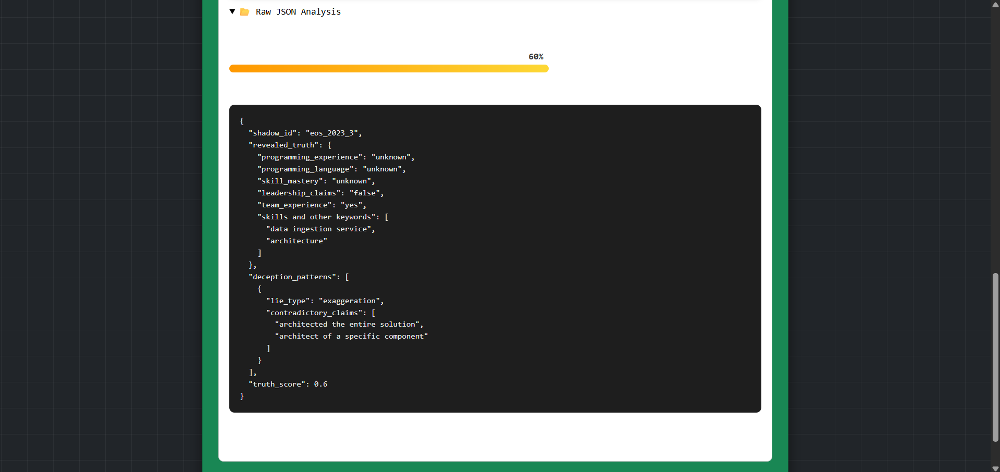

# 🕵️ Voice Detective – Truth Whisper  
**Innov8 3.0 Hackathon – IIT Delhi (ARIES & Eightfold AI)**  

An AI Detective that listens to voices, transcribes them, detects contradictions, and weaves together the most likely truth.

---

## ⚡ Problem Statement  
From the *Whispering Shadows Mystery*:  
- Shadows give contradictory testimonies across multiple sessions.  
- Audio quality may be noisy, emotional, whispered, or exaggerated.  

### Our AI Detective must:  
✅ Transcribe audio accurately despite noise.  
✅ Analyze contradictions across sessions.  
✅ Extract the most likely truth in structured JSON.  
✅ Provide both raw transcripts (`.txt`) and truth reports (`.json`).  

---

## 🛠️ Tech Stack  
- **Frontend** → HTML, CSS, JavaScript  
- **Backend** → FastAPI (Python)  
- **AI Models** →  
  - OpenAI Whisper → Audio transcription  
  - Groq LLM → Truth extraction & contradiction detection  

---

## 🚀 Features  
- 🎤 **Audio Upload** → Supports multiple `.mp3` / `.wav` files  
- 📝 **Whisper Transcription** → Converts noisy speech to text  
- 🔍 **Groq Analysis** → Detects contradictions & exaggerations  
- 📊 **Truth Score (0–1)** → Rates credibility of testimony  
- 🎨 **Color-Coded Summaries**:  
  - 🟥 Low truth (<50%)  
  - 🟧 Medium (50–75%)  
  - 🟩 High (>75%)  
- 📂 **JSON Output** → Hackathon Submission Scroll format  

---


## 📸 Screenshots

### 1. 🎤 Transcription UI


### 2. 📊 Truth Report


### 3. 🗂️ JSON Report



---

## ⚙️ Setup Instructions  

### 1️⃣ Clone Repository  
```bash
git clone https://github.com/AbhishekYadav65/voice_detective.git
cd voice_detective

2️⃣ Setup Virtual Environment
python -m venv .venv
# Activate venv
.venv\Scripts\activate      # Windows  
source .venv/bin/activate   # Linux/Mac

3️⃣ Install Dependencies
pip install --no-cache-dir -r backend/requirements.txt


4️⃣ Add API Key
Create a .env file inside backend/ with:
GROQ_API_KEY=your_api_key_here


5️⃣ Run Backend Server
cd backend
uvicorn app:app --reload

6️⃣ Open Frontend
Simply open frontend/index.html in a browser.


📂 Project Structure

voice_detective/
│── backend/
│   ├── app.py              # FastAPI server
│   ├── pipeline.py         # Transcription + Analysis logic
│   ├── requirements.txt    # Python dependencies
│── frontend/
│   ├── index.html          # Web UI
│   ├── script.js           # Upload + analysis logic
│   ├── style.css           # Styling
│── transcript.txt          # Sample transcript output
│── truth_report.json       # Sample truth report
│── transcription_ui.png    # Screenshot – transcription demo
│── truth_report_ui.png     # Screenshot – truth report demo
│── jason_report_ui.png     # Screenshot – JSON report demo
│── run_backend.bat         # Quickstart script (Windows)


